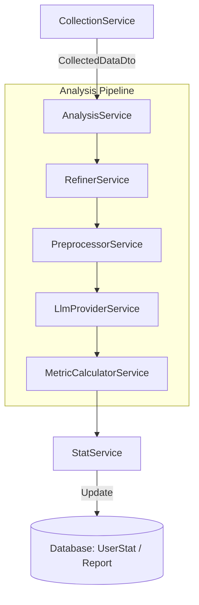

# Analysis 모듈 아키텍처 (Analysis Module Architecture)

`src/analysis` 모듈은 수집된 GitHub 데이터를 처리하여 사용자의 개발 역량을 분석하고 정량적인 지표로 변환하는 핵심 데이터 파이프라인을 담당합니다.

## 전체 데이터 흐름 (Data Flow)

## 서비스별 역할 상세 (Service Details)

### 1. AnalysisService (Orchestrator)

- 전체 분석 파이프라인의 **컨트롤 타워** 역할을 합니다.
- 각 세부 서비스를 순서대로 호출하며, 최종 결과를 데이터베이스 트랜잭션으로 저장합니다.

### 2. RefinerService (Data Filtering)

- 수집된 원본 데이터에서 분석에 불필요한 노이즈를 제거합니다.
- **주요 기능**: 봇 코멘트 제거, "LGTM", "Ok" 등 의미 없는 짧은 리뷰 필터링, 쓰레드 단위 그룹화.

### 3. PreprocessorService (Data Cleaning & Masking)

- LLM에 전달하기 전 데이터를 정제하고 최적화합니다.
- **주요 기능**: 마크다운 문법 제거, 코드 블록 Truncation (토큰 절약), 이메일/API Key 등 민감 정보 마스킹.

### 4. LlmProviderService (LLM Bridge)

- OpenAI API와 연동하여 실제 데이터를 분석합니다.
- **주요 기능**: 프롬프트 엔지니어링, Structured Output(JSON) 추출, API 장애 시 Mock 데이터 폴백 지원.

### 5. MetricCalculatorService (Quantification)

- LLM의 정성적 분석 결과를 수치화된 점수로 변환합니다.
- **주요 기능**: 역량별 가중치 적용, 문자열 형태의 평가(예: "수용적")를 숫자(100점)로 매핑.

### 6. StatService (Data Consolidation)

- 개별 분석 결과를 사용자의 전체 누적 통계에 반영합니다.
- **주요 기능**: **가중 평균(Weighted Average)** 방식 적용 (기존 70 : 신규 30 비율로 점수 완충).

## 데이터베이스 연동

- **AnalysisReport**: 각 분석 세션마다의 상세 지표를 JSON 형태로 보존합니다.
- **UserStat**: 모든 분석 데이터가 통합된 사용자의 현재 최종 역량 지표를 관리합니다.
