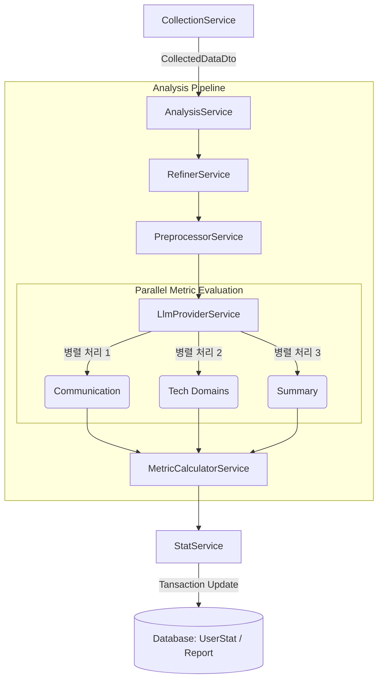

# Analysis 모듈 아키텍처 (Analysis Module Architecture)

`src/analysis` 모듈은 수집된 GitHub 데이터를 처리하여 사용자의 개발 역량을 분석하고 정량적인 지표로 변환하는 핵심 데이터 파이프라인을 담당합니다.

## 전체 데이터 흐름 (Data Flow)

## 서비스별 역할 상세 (Service Details)

### 1. AnalysisService (Orchestrator)

- 전체 분석 파이프라인의 **컨트롤 타워** 역할을 합니다.
- `LlmProviderService`에 분석 명령을 내리고 트랜잭션으로 저장합니다.

### 2. RefinerService (Data Filtering)

- 수집된 원본 데이터에서 분석에 불필요한 노이즈를 제거합니다.
- **주요 기능**: 봇 코멘트 제거, 의미 없는 짧은 리뷰(LGTM) 필터링.

### 3. PreprocessorService (Data Cleaning & Masking)

- LLM에 전달하기 전 데이터를 정제하고 최적화합니다.
- **주요 기능**: 마크다운 문법 제거, 민감 정보 마스킹, 문자열 토큰 Truncation.

### 5. LlmProviderService (LLM Bridge)

- OpenAI API와 연동하여 실무 데이터를 심층 분석합니다.
- **병렬 분석**: '커뮤니케이션', '기술 점수', '요약' 등 지표별로 분석 요청을 **동시에 병렬 처리(Promise.all)**하여 성능을 최적화합니다.

### 6. MetricCalculatorService (Quantification)

- 병합된 LLM의 정성적 분석 결과를 수치화된 점수로 변환합니다.
- **주요 기능**: 역량별 가중치 적용, 문자열 형태의 평가를 숫자(100점 만점)로 매핑.

### 7. StatService (Data Consolidation)

- 개별 분석 결과를 사용자의 전체 누적 통계에 반영합니다.
- **주요 기능**: **가중 평균(Weighted Average)** 방식 적용.

## 데이터베이스 연동 사항

- **AnalysisReport**: 세션마다 분석된 상세 LLM 결과를 JSON 형태로 기록.
- **UserStat**: 누적된 최종 역량 지표 및 랭킹 관리.
