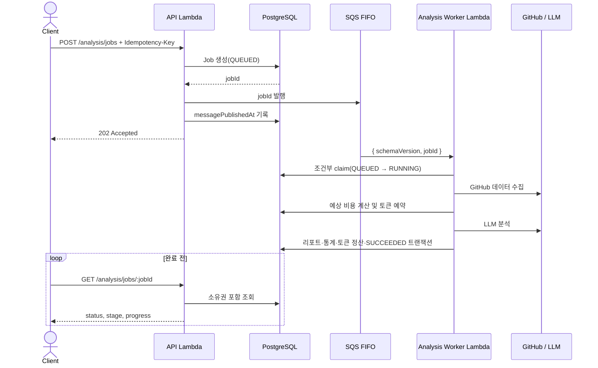
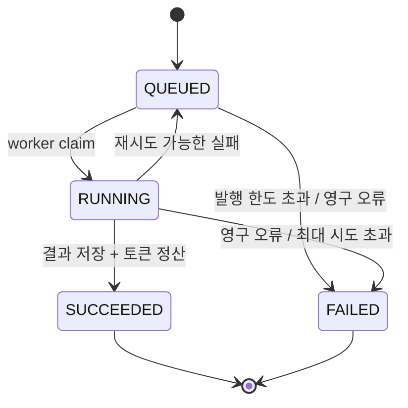

# ADR-0001: SQS FIFO 기반 비동기 분석 파이프라인

- 상태: **제안(Proposed)**
- 작성일: 2026-07-21
- 결정 대상: GitHub 데이터 수집 및 LLM 분석 실행 방식
- 후속 구현: AnalysisJob 모델, Job API, SQS 발행/복구, Worker, CDK/모니터링

> 이 문서는 설계 검토를 위한 ADR이다. 이 PR에서는 애플리케이션 코드, Prisma 스키마,
> 데이터베이스 및 AWS 리소스를 변경하지 않는다. 아래 Prisma 코드는 다음 PR에서 적용할
> **예상안**이며, 이 문서가 승인된 뒤 별도 마이그레이션으로 구현한다.

## 1. 배경과 현재 문제

현재 `POST /collection/sync/:githubRepoId`는 한 HTTP 요청 안에서 다음 작업을 모두 기다린다.

1. GitHub PR 및 리뷰 데이터 수집
2. 데이터 정제와 토큰 계산
3. 여러 LLM 요청 실행
4. 리포트·통계 저장과 토큰 차감

이 구조에는 다음 문제가 있다.

- API Lambda가 GitHub와 LLM 응답을 모두 기다려야 하므로 타임아웃 위험이 크다.
- 클라이언트 연결이 끊기면 서버 작업의 성공 여부를 확인하기 어렵다.
- 재요청과 Lambda 재시도가 같은 분석을 중복 실행할 수 있다.
- 현재 토큰 확인과 실제 차감 사이에 간격이 있어 동시 요청이 잔액을 초과할 수 있다.
- 분석 진행 상태, 재시도 횟수, 실패 원인과 복구 여부가 DB에 남지 않는다.
- HTTP 요청, DB 트랜잭션, 외부 LLM 호출을 하나의 원자적 작업으로 묶을 수 없다.

목표는 API가 작업 접수만 빠르게 완료하고, 분석은 재시도 가능한 Worker가 수행하도록
분리하는 것이다. 시스템의 최종 진실(source of truth)은 SQS가 아니라 PostgreSQL의
`AnalysisJob`으로 둔다.

## 2. 결정 요약

- 분석 요청은 `AnalysisJob`을 생성하고 `202 Accepted`를 반환한다.
- 메시지 큐는 **Amazon SQS FIFO**를 사용한다.
- SQS 메시지 본문에는 `schemaVersion`과 `jobId`만 넣는다.
- `MessageGroupId`는 `{userId}:{repositoryId}`, `MessageDeduplicationId`는 `jobId`로 한다.
- Job 상태는 `QUEUED`, `RUNNING`, `SUCCEEDED`, `FAILED` 네 종류만 사용한다.
- 세부 진행 상황은 상태를 늘리지 않고 별도 `stage`와 `progress`로 표현한다.
- 작업 생성과 토큰 예약은 분리한다. Worker가 수집을 마치고 비용을 계산한 직후,
  LLM 호출 전에 DB 트랜잭션으로 토큰을 예약한다.
- DB 커밋과 SQS 발행 사이의 원자성 문제는 `AnalysisJob` 자체를 outbox로 사용해 복구한다.
- SQS FIFO의 중복 제거는 보조 장치로만 사용하고, 영구적인 중복 방지는 DB 조건부 갱신으로
  보장한다.
- 기존 동기 API는 프론트 전환 기간 동안 유지한 뒤 단계적으로 폐기한다.

## 3. 목표와 비목표

### 목표

- API 요청 시간을 외부 GitHub/LLM 처리 시간과 분리한다.
- 같은 사용자에 대한 통계 갱신과 토큰 정산을 순서대로 처리한다.
- 중복 메시지와 Lambda 재시도에도 리포트가 한 번만 확정되게 한다.
- 프로세스가 어느 지점에서 종료돼도 DB와 스케줄러를 통해 복구할 수 있게 한다.
- 프론트가 새로고침 후에도 작업 상태와 결과를 다시 찾을 수 있게 한다.

### 비목표

- 이 단계에서는 작업 취소와 우선순위 큐를 제공하지 않는다.
- 여러 리전에서 동시에 처리하는 active-active 구조는 다루지 않는다.
- 외부 LLM 호출 자체에 대한 정확히 한 번(exactly-once) 실행은 보장하지 않는다.
  외부 API와 DB 사이에는 분산 트랜잭션이 없으므로 짧은 중복 과금 가능 구간은 남는다.
- 원본 PR 본문이나 LLM 프롬프트를 SQS 메시지, Job 행 또는 로그에 저장하지 않는다.

## 4. 전체 흐름



API의 SQS 발행이 실패해도 이미 생성된 `QUEUED` Job은 삭제하지 않는다. 예약 발행기와
복구 스케줄러가 미발행 Job을 다시 전송한다.

## 5. SQS FIFO를 선택하는 이유

`MessageGroupId={userId}:{repositoryId}`를 사용하면 같은 사용자·저장소의 분석 순서는
보장하면서, 한 사용자의 서로 다른 저장소 작업은 병렬 처리할 수 있다. 저장소별 활성 Job
제한 및 Worker의 DB claim과 함께 사용해 순서와 처리량의 균형을 맞춘다.

| 대안           | 장점                                                                      | 단점 및 이번 결정                                                                                                                         |
| -------------- | ------------------------------------------------------------------------- | ----------------------------------------------------------------------------------------------------------------------------------------- |
| **SQS FIFO**   | AWS 관리형, Lambda 직접 연동, 그룹 내 순서 보장, 발행 중복 완화, DLQ 지원 | 그룹 단위 직렬화로 처리량이 제한되지만 현재 사용자별 분석 빈도에는 적합하다. **선택**                                                     |
| SQS Standard   | 처리량과 병렬성이 높고 단순하다                                           | 순서를 보장하지 않고 중복 전달을 기본 전제로 한다. 사용자 통계 갱신 순서를 별도로 제어해야 한다. 향후 FIFO 처리량이 병목일 때 재검토한다. |
| BullMQ + Redis | 지연 작업, 재시도, UI 생태계가 풍부하다                                   | Redis 운영·연결 관리가 추가되고 Lambda/VPC 구성 복잡도가 증가한다. 현재 AWS 중심 배포에서는 관리형 SQS가 더 단순하다.                     |
| EventBridge    | 이벤트 라우팅과 여러 소비자 연결에 강하다                                 | 장시간 작업의 backpressure와 엄격한 그룹 순서 제어를 위한 작업 큐로는 맞지 않는다. Job 완료 이벤트 확장 시 보조적으로 사용할 수 있다.     |
| Kafka/MSK      | 높은 처리량, 파티션 순서, 장기 재생이 가능하다                            | 현재 규모에 비해 비용과 운영 부담이 크다.                                                                                                 |

SQS FIFO의 deduplication ID 추적 시간은 5분이다. 이 시간이 지난 뒤 같은 메시지가 다시
발행될 수 있으므로 FIFO를 정확히 한 번 처리 보장으로 해석하지 않는다. 최종 멱등성은
`AnalysisJob.status`, `leaseToken`, `tokensSettledAt`, `resultReportId`에 대한 DB 조건으로
보장한다.

## 6. SQS 메시지 계약

```json
{
  "schemaVersion": 1,
  "jobId": "8fe6a55c-956a-4d8f-985f-fcf2bc72e34c"
}
```

- `MessageGroupId`: `{userId}:{repositoryId}`
- `MessageDeduplicationId`: `jobId`
- 메시지 속성: `traceId`, `schemaVersion`
- 메시지에 사용자 토큰, GitHub 토큰, 저장소 원문, 프롬프트를 넣지 않는다.
- Worker는 메시지 값을 신뢰하지 않고 `jobId`로 DB를 조회해 사용자·저장소·상태를 다시
  검증한다.

초기 인프라 권장값은 다음과 같다.

- Worker Lambda timeout: 10분
- SQS visibility timeout: 60분(함수 timeout의 6배)
- batch size: 1
- `ReportBatchItemFailures`: 활성화
- source queue retention: 4일
- FIFO DLQ retention: 14일
- `maxReceiveCount`: 5

분석 시간이 10분에 가까워지면 timeout을 바로 늘리기보다 GitHub 수집량 제한 또는 분석
단계 분할을 먼저 검토한다.

## 7. Job 상태 전이

상태는 운영과 API에서 의미가 달라지지 않도록 네 개로 제한한다.

| 상태        | 의미                                                    | 허용되는 다음 상태              |
| ----------- | ------------------------------------------------------- | ------------------------------- |
| `QUEUED`    | DB에 접수됐으며 발행 대기, SQS 대기 또는 재시도 대기 중 | `RUNNING`, `FAILED`             |
| `RUNNING`   | Worker가 유효한 lease를 소유하고 처리 중                | `QUEUED`, `SUCCEEDED`, `FAILED` |
| `SUCCEEDED` | 리포트 저장과 토큰 정산까지 완료된 종결 상태            | 없음                            |
| `FAILED`    | 재시도 불가 오류 또는 최대 시도 초과로 종료된 상태      | 없음. 재실행은 새 Job 생성      |



`PUBLISHING`, `RETRYING`, `TOKEN_RESERVED`, `COMPLETED_WITH_WARNING` 같은 상태는 추가하지
않는다. 다음 필드로 세부 상황을 표현한다.

- `stage`: `WAITING`, `COLLECTING`, `RESERVING_TOKENS`, `ANALYZING`, `SAVING`
- `progress`: 현재 시도 기준 0~100의 거친 진행률. ETA나 정확한 작업량을 뜻하지 않는다.
- `attemptCount`, `messagePublishedAt`, `nextPublishAt`, `leaseExpiresAt`
- `lastErrorCode`, `lastErrorMessage`

재시도 때 `stage`와 `progress`는 이전 단계로 돌아갈 수 있으므로 프론트는 퍼센트를 완료
보장으로 해석하지 않고 `status`와 `stage`를 함께 표시한다.

## 8. 신규 API 계약

모든 엔드포인트는 JWT 인증, 전역 ValidationPipe, 사용자 기반 rate limit을 적용한다.
저장소와 Job은 현재 사용자의 소유 조건을 쿼리에 포함해 조회하며, 다른 사용자의 리소스는
존재 여부를 노출하지 않도록 `404`를 반환한다.

### 8.1 Job 생성

```http
POST /analysis/jobs
Authorization: Bearer <jwt>
Idempotency-Key: 01J2Q8R3K6V8M2N7S4T5W9X0YZ
Content-Type: application/json

{
  "githubRepoId": "123456789"
}
```

- `Idempotency-Key`는 필수이며 1~128자의 불투명 문자열이다.
- 브라우저 요청을 위해 CORS `allowedHeaders`에 `Idempotency-Key`를 추가한다.
- 같은 사용자·같은 키·같은 요청은 기존 Job을 반환한다.
- 같은 키를 다른 저장소 요청에 재사용하면 `409 IDEMPOTENCY_KEY_REUSED`를 반환한다.
- API는 저장소 소유권과 `availableTokens > 0`만 빠르게 확인한다. 정확한 토큰 예약은
  Worker가 수집 및 계산을 마친 뒤 수행한다.
- 작업 생성 전용 rate limit 권장값은 사용자당 분당 5회이며, 인증된 `userId`를 제한 키로
  사용한다. 인증 전 요청만 IP를 사용하고, 기존 전역 분당 60회보다 엄격하게 적용한다.

```http
HTTP/1.1 202 Accepted
Location: /analysis/jobs/8fe6a55c-956a-4d8f-985f-fcf2bc72e34c
Retry-After: 2
```

```json
{
  "jobId": "8fe6a55c-956a-4d8f-985f-fcf2bc72e34c",
  "status": "QUEUED",
  "stage": "WAITING",
  "progress": 0,
  "attempt": 0,
  "repository": {
    "id": 17,
    "githubRepoId": "123456789",
    "fullName": "octocat/example"
  },
  "tokens": {
    "estimated": null,
    "reserved": null,
    "consumed": 0
  },
  "result": null,
  "error": null,
  "createdAt": "2026-07-21T10:00:00.000Z",
  "updatedAt": "2026-07-21T10:00:00.000Z",
  "links": {
    "self": "/analysis/jobs/8fe6a55c-956a-4d8f-985f-fcf2bc72e34c"
  }
}
```

정확한 예상 비용은 GitHub 수집 뒤 채워지므로 최초 응답의 `estimated`와 `reserved`는
`null`이다. 프론트는 이를 0으로 표시하지 않고 "계산 중"으로 표시한다.

### 8.2 Job 단건 조회

```http
GET /analysis/jobs/:jobId
Authorization: Bearer <jwt>
```

처리 중에는 위와 같은 응답 형태와 `Retry-After: 2`를 반환한다. 성공 시 기존 리포트 API로
이동할 수 있는 ID와 링크를 제공한다.

```json
{
  "jobId": "8fe6a55c-956a-4d8f-985f-fcf2bc72e34c",
  "status": "SUCCEEDED",
  "stage": null,
  "progress": 100,
  "attempt": 1,
  "tokens": {
    "estimated": 18200,
    "reserved": 22000,
    "consumed": 17640
  },
  "result": {
    "reportId": 481,
    "href": "/analysis/reports/481"
  },
  "error": null,
  "createdAt": "2026-07-21T10:00:00.000Z",
  "startedAt": "2026-07-21T10:00:03.000Z",
  "completedAt": "2026-07-21T10:01:42.000Z",
  "updatedAt": "2026-07-21T10:01:42.000Z"
}
```

실패 응답은 HTTP 통신 자체가 성공했으므로 `200`과 `status: FAILED`를 반환한다. 사용자에게
노출 가능한 코드와 일반화된 메시지만 제공하며 내부 stack, provider 응답, 토큰은 숨긴다.

```json
{
  "jobId": "8fe6a55c-956a-4d8f-985f-fcf2bc72e34c",
  "status": "FAILED",
  "stage": null,
  "progress": 35,
  "attempt": 1,
  "result": null,
  "error": {
    "code": "INSUFFICIENT_TOKENS",
    "message": "분석에 필요한 토큰이 부족합니다.",
    "retryable": false
  }
}
```

### 8.3 Job 목록 조회

```http
GET /analysis/jobs?repositoryId=17&status=RUNNING&limit=20&cursor=<opaque>
Authorization: Bearer <jwt>
```

- 새로고침, 다른 기기 접속, 일시적인 네트워크 단절 후에도 진행 중 Job을 복구하기 위한 API다.
- cursor 기반 페이지네이션을 사용하며 기본 20개, 최대 100개로 제한한다.
- 응답 항목은 단건 조회와 같은 형태를 사용한다.

### 8.4 오류 계약

| HTTP  | 코드                                    | 조건                                       |
| ----- | --------------------------------------- | ------------------------------------------ |
| `400` | `INVALID_REQUEST`                       | DTO 또는 Idempotency-Key 형식 오류         |
| `401` | `UNAUTHORIZED`                          | JWT 없음 또는 만료                         |
| `404` | `REPOSITORY_NOT_FOUND`, `JOB_NOT_FOUND` | 소유하지 않았거나 존재하지 않음            |
| `409` | `IDEMPOTENCY_KEY_REUSED`                | 같은 키로 다른 요청 제출                   |
| `429` | `RATE_LIMITED`                          | 사용자별 생성 제한 초과                    |
| `503` | `JOB_ACCEPTANCE_UNAVAILABLE`            | DB에 Job을 만들 수 없어 접수 자체가 실패함 |

DB 커밋 뒤 SQS 발행이 실패한 경우에는 이미 접수된 Job이므로 `202`를 반환하고 복구
발행기가 처리한다. 이 경우 API는 `QUEUED` 상태를 그대로 노출한다.

## 9. Prisma 변경 전후 예상 모델

### 9.1 현재

현재 `User.availableTokens`, `Repository`, `AnalysisReport`는 있지만 실행 중인 분석을 나타내는
모델은 없다.

```prisma
model User {
  id              Int @id @default(autoincrement())
  availableTokens Int @default(100000)
  reports         AnalysisReport[]
}

model Repository {
  id      Int @id @default(autoincrement())
  reports AnalysisReport[]
}

model AnalysisReport {
  id           Int @id @default(autoincrement())
  userId       Int
  repositoryId Int
  metrics      Json?
}
```

### 9.2 제안

아래 필드명과 타입은 다음 Prisma PR에서 최종 검증한다. 이 ADR에서는 개념과 불변 조건을
승인받는 것이 목적이다.

```prisma
enum AnalysisJobStatus {
  QUEUED
  RUNNING
  SUCCEEDED
  FAILED
}

enum AnalysisJobStage {
  WAITING
  COLLECTING
  RESERVING_TOKENS
  ANALYZING
  SAVING
}

model AnalysisJob {
  id               String            @id @default(uuid())
  status           AnalysisJobStatus @default(QUEUED)
  stage            AnalysisJobStage? @default(WAITING)
  progress         Int               @default(0)

  userId           Int
  repositoryId     Int
  idempotencyKey   String
  requestHash      String
  sourceCursor     DateTime?
  analysisVersion  String

  estimatedTokens  Int?
  reservedTokens   Int?
  consumedTokens   Int               @default(0)
  tokensSettledAt  DateTime?
  usage            Json? // provider request ID와 단계별 토큰 수만 저장

  publishAttempts  Int               @default(0)
  messagePublishedAt DateTime?
  nextPublishAt    DateTime?

  attemptCount     Int               @default(0)
  maxAttempts      Int               @default(5)
  leaseToken       String?
  leaseExpiresAt   DateTime?
  heartbeatAt      DateTime?

  lastErrorCode    String?
  lastErrorMessage String?           // 사용자·운영용으로 정제하고 길이 제한
  errorRetryable   Boolean?

  resultReportId   Int?              @unique
  startedAt        DateTime?
  completedAt      DateTime?
  createdAt        DateTime          @default(now())
  updatedAt        DateTime          @updatedAt

  user             User              @relation(fields: [userId], references: [id], onDelete: Cascade)
  repository       Repository        @relation(fields: [repositoryId], references: [id], onDelete: Restrict)
  resultReport     AnalysisReport?   @relation("AnalysisJobResult", fields: [resultReportId], references: [id])

  @@unique([userId, idempotencyKey])
  @@index([status, nextPublishAt, messagePublishedAt])
  @@index([status, leaseExpiresAt])
  @@index([userId, createdAt])
  @@index([repositoryId, createdAt])
  @@map("analysis_jobs")
}

model User {
  // 기존 필드 유지
  analysisJobs AnalysisJob[]
}

model Repository {
  // 기존 필드 유지
  analysisJobs AnalysisJob[]
}

model AnalysisReport {
  // 기존 필드 유지
  analysisJob AnalysisJob? @relation("AnalysisJobResult")
}
```

`requestHash`는 같은 `Idempotency-Key`가 동일한 요청에 사용됐는지 비교하는 값이다. 원문이나
토큰을 해시에 포함하지 않고 정규화된 `userId`, `repositoryId`, `analysisVersion`으로 만든다.

### 9.3 핵심 불변 조건

- `SUCCEEDED`이면 `resultReportId`, `tokensSettledAt`, `completedAt`이 반드시 존재한다.
- `FAILED`이면 `completedAt`, `lastErrorCode`가 반드시 존재한다. 단,
  `PROVIDER_RECONCILIATION_REQUIRED`는 과금액을 확정할 수 없으므로 `tokensSettledAt`을
  `NULL`로 유지할 수 있다.
- `RUNNING` 작업을 갱신할 때는 `id + leaseToken`을 함께 비교한다.
- `tokensSettledAt`이 설정된 Job은 토큰을 다시 차감하거나 환불하지 않는다.
- 하나의 `AnalysisReport`는 최대 하나의 `AnalysisJob` 결과다.
- `progress`는 0~100, 토큰 값과 시도 횟수는 0 이상이어야 한다. Prisma만으로 표현하기
  어려운 제약은 SQL CHECK 또는 서비스 검증으로 추가한다.

## 10. 토큰 예약과 정산

Job 생성 시에는 정확한 데이터 크기를 모르므로 토큰을 예약하지 않는다. Worker가 GitHub
수집과 전처리를 마친 다음 다음 순서로 처리한다.

1. 입력 토큰과 각 LLM 호출의 최대 출력 토큰을 합쳐 `reservedTokens`를 계산한다.
2. DB 트랜잭션에서 `availableTokens >= reservedTokens` 조건으로 User를 갱신한다.
3. 조건을 만족하면 `availableTokens`를 즉시 감소시키고 Job에 `reservedTokens`를 기록한다.
4. 조건을 만족하지 않으면 외부 LLM을 호출하지 않고 `INSUFFICIENT_TOKENS`로 실패한다.
5. 각 LLM 응답 직후 provider request ID와 사용량을 Job의 `usage`와 `consumedTokens`에
   누적한다. 프롬프트와 응답 원문은 넣지 않는다.
6. 성공 또는 최종 실패 시 `tokensSettledAt IS NULL` 조건으로 한 번만 정산한다.
7. `reservedTokens - consumedTokens`만큼 `availableTokens`에 환불한다.

재시도 Job에 이미 `reservedTokens`가 있으면 다시 예약하거나 잔액을 차감하지 않는다.
동일한 예약 한도 안에서 `consumedTokens`만 누적하고, 종결 시 한 번 정산한다.

예약액은 입력 예상치만 사용하지 않고 설정된 최대 출력량까지 포함하므로 정상 흐름에서는
`consumedTokens <= reservedTokens`여야 한다. 이 조건을 초과하면 초과분을
`availableTokens >= additionalTokens` 조건으로 원자적으로 추가 차감한다. 성공하면 실제
사용량 전액을 `TOKEN_BUDGET_EXCEEDED`로 정산하고, 실패하면 실제 사용량은 보존하되
`tokensSettledAt`을 설정하지 않고 `PROVIDER_RECONCILIATION_REQUIRED`로 격리한다.

외부 LLM 호출 성공 직후 DB 기록 전에 Lambda가 종료되면 실제 과금과 `consumedTokens` 사이에
차이가 생길 수 있다. 이 구간은 분산 트랜잭션으로 제거할 수 없다. provider request ID를
구조화 로그와 `usage`에 가능한 즉시 남기고, 차이가 의심되는 Job은 자동 재실행하지 않은 채
운영자가 대사(reconciliation)하도록 한다.

Provider request ID는 확인했지만 usage가 누락되거나 유효하지 않으면 토큰 필드를 0으로
변환하지 않는다. request ID만 체크포인트하고 토큰 필드와 `tokensSettledAt`을 `NULL`로
유지하여 "0 토큰 사용"과 "사용량 미확정"을 구분한다.

## 11. 중복 요청과 중복 메시지 처리

중복 방지는 세 계층에서 수행한다.

1. **HTTP 계층**: `(userId, idempotencyKey)` unique 제약으로 더블 클릭과 네트워크 재전송이
   같은 Job을 반환하게 한다.
2. **SQS 계층**: `MessageDeduplicationId=jobId`로 5분 이내 중복 발행을 줄인다.
3. **DB 계층**: Worker가 조건부 갱신으로 Job을 claim하고, 종결 상태는 즉시 ack한다.

Worker claim 규칙은 다음과 같다.

- `QUEUED`: 새 `leaseToken`과 만료 시간을 만들고 `RUNNING`으로 변경한다.
- `RUNNING`이며 lease가 만료됨: 새 token으로 lease를 인수하고 `attemptCount`를 증가시킨다.
- `RUNNING`이며 lease가 유효함: 처리하지 않고 재시도 대상으로 반환한다.
- `SUCCEEDED` 또는 `FAILED`: 외부 호출 없이 성공 응답해 SQS 메시지를 삭제한다.

모든 Worker DB 갱신은 자신이 받은 `leaseToken`을 조건에 포함한다. 이전 Worker가 늦게
완료되더라도 lease를 인수한 새 Worker의 결과를 덮어쓸 수 없다.

리포트 생성, 통계 갱신, Job 성공 처리, 토큰 정산은 하나의 DB 트랜잭션으로 수행한다.
트랜잭션 커밋 전에 실패하면 메시지를 재시도하고, 커밋 후 Lambda 응답이 유실되면 다음
전달에서 종결 상태를 확인하고 ack한다.

## 12. DB와 SQS 사이의 실패 복구

DB 트랜잭션과 `SendMessage`는 원자적으로 묶을 수 없으므로 Job 행을 outbox로 사용한다.

| 실패 지점                         | 남는 상태                             | 복구 방식                                                        |
| --------------------------------- | ------------------------------------- | ---------------------------------------------------------------- |
| Job 생성 전 DB 실패               | Job 없음                              | `503`, 클라이언트가 같은 Idempotency-Key로 재시도                |
| Job 커밋 후 SQS 발행 실패         | `QUEUED`, `messagePublishedAt=null`   | API는 `202`; 1분 주기 발행 복구기가 재발행                       |
| SQS 성공 후 publishedAt 기록 실패 | SQS 메시지 존재, DB는 미발행처럼 보임 | 복구기가 같은 jobId로 재발행; FIFO dedupe와 DB claim이 중복 방지 |
| Worker 시작 전 실패               | `QUEUED`                              | visibility timeout 후 Lambda 재전달                              |
| Worker 처리 중 timeout/crash      | `RUNNING`, lease 만료 예정            | SQS 재전달 후 만료 lease 인수                                    |
| 일시적 GitHub/LLM/DB 오류         | `QUEUED`, 오류와 backoff 기록         | 예외를 반환해 SQS 재시도                                         |
| 영구 오류                         | `FAILED`, 토큰 정산 완료              | 메시지를 ack하고 사용자에게 오류 코드 노출                       |
| 최대 수신 횟수 초과               | 메시지가 FIFO DLQ로 이동              | DLQ reconciler가 Job을 `FAILED`로 만들고 토큰 정산               |

발행 복구기는 다음 Job을 조회한다.

- `status=QUEUED`이고 `messagePublishedAt IS NULL`
- 또는 `status=QUEUED`이고 마지막 발행 뒤 복구 임계 시간이 지남
- `nextPublishAt <= now()`이며 발행 시도 한도 미만

복구기 여러 인스턴스가 같은 Job을 발행해도 안전해야 한다. 중복 발행 자체를 완전히 막기
위해 분산 락을 추가하지 않고, SQS dedupe와 DB claim으로 처리 중복을 막는다. 발행 시도 한도를
넘기면 `PUBLISH_FAILED`로 종결하고 아직 예약된 토큰이 있다면 정산한다.

FIFO에서 부분 배치 실패를 사용할 때는 첫 실패 이후 같은 배치의 미처리 메시지도 실패 목록에
포함해야 순서가 유지된다. 초기 `batch size=1`은 이 규칙과 장시간 분석의 실행 시간 계산을
단순하게 만든다.

## 13. 오류 분류와 재시도

### 재시도 가능

- GitHub API 429/5xx 및 일시적 네트워크 오류
- LLM provider 429/5xx 및 일시적 네트워크 오류
- DB 연결 오류와 직렬화 충돌
- Lambda timeout 또는 런타임 종료

지수 backoff와 jitter를 사용하고 `attemptCount < maxAttempts`일 때만 `QUEUED`로 되돌린다.

### 재시도 불가

- GitHub App 설치 해제 또는 저장소 접근 권한 상실
- 저장소 삭제
- 의미 있는 분석 데이터 없음
- 토큰 부족
- 지원하지 않는 메시지 `schemaVersion`
- 검증할 수 없는 LLM 응답이 정해진 내부 재요청 횟수를 초과함

재시도 불가 오류는 즉시 `FAILED`로 기록하고 토큰을 정산한 뒤 메시지를 ack한다.

## 14. 모니터링과 운영

CloudWatch에 다음 지표와 경보를 구성한다.

- source queue `ApproximateAgeOfOldestMessage`
- source queue와 DLQ의 visible message 수
- Lambda error, throttle, duration p95/p99, concurrent executions
- `QUEUED` 미발행 Job 수와 가장 오래된 생성 시각
- lease가 만료된 `RUNNING` Job 수
- 상태별 완료/실패율, 평균 재시도 횟수
- 예약 대비 실제 토큰 사용량과 미정산 Job 수

구조화 로그 공통 필드는 `jobId`, `userId`, `repositoryId`, `attempt`, `leaseToken`의 축약값,
`awsRequestId`, `stage`, `errorCode`다. GitHub 토큰, JWT, 프롬프트, 원문, 전체 lease token은
로그에 남기지 않는다.

운영 대시보드의 초기 SLO는 다음과 같다.

- 접수 API p95 1초 이하
- 정상 부하에서 Job 대기 시간 p95 1분 이하
- Job 성공률 99% 이상(사용자 입력·권한·토큰 부족 실패 제외)
- 미발행 `QUEUED` Job 5분 초과 시 경보
- DLQ 메시지 1개 이상이면 즉시 경보

## 15. 기존 동기 API 폐기 일정

대상은 `POST /collection/sync/:githubRepoId`다. 비용 조회 API와 기존 리포트 조회 API는 이
폐기 대상에 포함하지 않는다.

| 목표일     | 단계             | 동작                                                                                  |
| ---------- | ---------------- | ------------------------------------------------------------------------------------- |
| 2026-08-15 | 병행 운영 시작   | 비동기 Job API를 배포하고 내부/테스트 사용자부터 사용                                 |
| 2026-09-01 | 프론트 기본 전환 | 신규 분석은 Job API 사용. 기존 API에 `Deprecation`, `Sunset`, 새 API `Link` 헤더 추가 |
| 2026-10-01 | 폐기 판정        | 최근 30일 기존 API 호출 0건, 프론트 100% 전환, Job SLO 충족 여부 확인                 |
| 2026-10-15 | 제거 목표        | 조건 충족 시 기존 API를 제거. 미충족 시 사유와 새 일정을 이 ADR 후속 기록에 남김      |

폐기 기간에는 기존 API의 요청·응답 계약을 바꾸지 않는다. 내부 구현을 비동기로 바꾸면서
기존 `200 + CollectedDataDto` 응답을 `202`로 바꾸는 것은 호환이 아니므로 금지한다.
기존 동기 API도 응답 계약은 유지하되 내부에서는 즉시 `AnalysisJob`을 만들고 같은 예약,
과금 체크포인트, 정산 규칙을 사용한다.

## 16. 구현 PR 순서와 승인 경계

1. **현재 PR — ADR**: 결정과 계약만 검토하며 코드·DB를 변경하지 않는다.
2. **AnalysisJob DB 모델**: 승인된 예상 모델과 마이그레이션을 별도 PR로 적용한다.
3. **Job API**: DTO, JWT/소유권, idempotency, 목록/상태 조회를 구현한다.
4. **SQS 발행과 복구**: Job outbox publisher와 예약 복구기를 구현한다.
5. **Analysis Worker**: claim, lease, 토큰 예약, 파이프라인, 정산을 구현한다.
6. **GitHub 증분 수집 / AI 검증**: 별도 PR에서 단계 체크포인트와 품질 평가를 강화한다.
7. **CDK·모니터링·전환**: 큐, DLQ, Lambda, 경보와 기존 API 폐기 헤더를 적용한다.

Prisma 모델 PR은 다음 내용을 포함해야 한다.

- 변경 전/후 schema diff와 마이그레이션 SQL
- 기존 데이터에 대한 영향과 rollback 절차
- unique/index/check 제약 검증
- 토큰 예약·정산 동시성 테스트
- 사용자 승인 후 마이그레이션 실행

## 17. 리뷰 요청 사항

- 상태 네 개와 별도 stage가 필요한 표현력을 제공하면서도 과도하지 않은가?
- lease, 토큰 정산, 발행 복구, 결과 연결에 필요한 DB 정보가 빠지지 않았는가?
- 최초 비용이 `null`인 `202` 응답과 상태/목록 API가 프론트 요구사항을 만족하는가?
- Job 행을 outbox로 사용하는 SQS/DB 실패 복구 방식과 운영 임계값이 타당한가?
- 사용자·저장소 단위 `MessageGroupId`의 직렬화가 순서 보장과 처리량 사이에서 적절한가?

## 18. 참고 자료

- [AWS: FIFO queue message identifiers](https://docs.aws.amazon.com/AWSSimpleQueueService/latest/SQSDeveloperGuide/sqs-fifo-queue-message-identifiers.html)
- [AWS: Handling errors for an SQS event source in Lambda](https://docs.aws.amazon.com/lambda/latest/dg/services-sqs-errorhandling.html)
- [AWS: Configuring SQS to trigger Lambda](https://docs.aws.amazon.com/AWSSimpleQueueService/latest/SQSDeveloperGuide/sqs-configure-lambda-function-trigger.html)
- [AWS: Using dead-letter queues in Amazon SQS](https://docs.aws.amazon.com/AWSSimpleQueueService/latest/SQSDeveloperGuide/sqs-dead-letter-queues.html)
- [AWS: SQS, SNS, or EventBridge decision guide](https://docs.aws.amazon.com/pdfs/decision-guides/latest/sns-or-sqs-or-eventbridge/sns-or-sqs-or-eventbridge.pdf)
